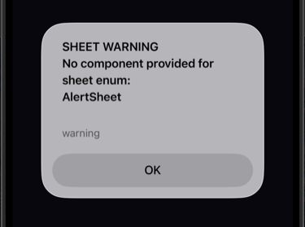
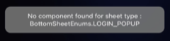

# Sheet Library

A flexible, reusable sheet/modal library for React Native. Supports bottom sheets, middle popups, and top toasts. **Position your sheet content anywhere** — top, center, or bottom — using `justifyContent` in your component styles.

## Installation

This library is already included in the project at `libraries/sheet`.

### Dependencies

Make sure you have these peer dependencies installed:

```bash
# npm
npm install react-native-gesture-handler react-native-reanimated @react-native-community/blur

# or yarn
yarn add react-native-gesture-handler react-native-reanimated @react-native-community/blur
```

### React Native & Reanimated Compatibility

| React Native | Reanimated | Worklets | Babel plugin |
|--------------|------------|----------|--------------|
| **0.74** (Legacy) | 3.x | — | `react-native-reanimated/plugin` |
| **0.78–0.82** | 4.1.x | 0.5.x | `react-native-worklets/plugin` |
| **0.80–0.84** | 4.2.x | 0.7.x | `react-native-worklets/plugin` |

**RN 0.74:** Use Reanimated 3.x. No `react-native-worklets` needed. Use `react-native-reanimated/plugin` in Babel.

**RN 0.78–0.82 (e.g. 0.79):** Use Reanimated 4.1.x + Worklets 0.5.x:

```bash
yarn add react-native-reanimated@^4.1.0 react-native-worklets@^0.5.0
```

**RN 0.80+:** Use Reanimated 4.2.x + Worklets 0.7.x:

```bash
yarn add react-native-reanimated@^4.2.0 react-native-worklets@^0.7.0
```

For Reanimated 4.x, add the worklets plugin to `babel.config.js` (as a separate plugin, not inside module-resolver):

```javascript
plugins: [
  'react-native-worklets/plugin',
  // ... other plugins like module-resolver
];
```

## Quick Start

### 1. Define Your Enums

```typescript
// enums.ts
export enum SheetEnums {
  ALERT = 'Alert',
  CONFIRM = 'Confirm',
  TOAST = 'Toast',
}
```

### 2. Create Your Sheet Components

```typescript
// sheets/AlertSheet.tsx
const AlertSheet = ({title, message, onClose}) => (
  <View style={styles.container}>
    <Text>{title}</Text>
    <Text>{message}</Text>
    <Button title="Close" onPress={onClose} />
  </View>
);
```

### 3. Set Up in App

```typescript
import {SheetHandler, SheetHandlerRef} from '@libraries/sheet';

<SheetHandler
  ref={SheetHandlerRef}
  sheetEnums={SheetEnums}
  sheetComponents={{
    [SheetEnums.ALERT]: AlertSheet,
    [SheetEnums.CONFIRM]: ConfirmSheet,
  }}
  defaultSheetConfig={{
    [SheetEnums.ALERT]: {disablePan: false, blur: true},
    [SheetEnums.CONFIRM]: {disablePan: true, blur: true},
  }}
/>;
```

### 4. Show Sheets

```typescript
import {showSheet, hideSheet} from '@libraries/sheet';

// Show
showSheet({
  type: SheetEnums.ALERT,
  props: {
    title: 'Hello',
    message: 'World',
    onClose: () => hideSheet(),
  },
});

// Hide
hideSheet();
```

## Position Examples

You can place sheet content anywhere on the screen by using `justifyContent` in your component's container style. Here are three sample components for each position:

### 1. Top Sheet (`flex-start`)

Content anchored at the top of the modal. Ideal for banners, notifications, or top-aligned actions.

```tsx
// TopSheetExample.tsx
import React from 'react';
import {
  SafeAreaView,
  StyleSheet,
  Text,
  TouchableOpacity,
  View,
} from 'react-native';
import {hideSheet} from '@sheet';

const TopSheetExample = () => (
  <SafeAreaView style={styles.container}>
    <View style={styles.content}>
      <Text style={styles.title}>Top Sheet</Text>
      <Text style={styles.subtitle}>Content at flex-start</Text>
      <TouchableOpacity onPress={() => hideSheet()}>
        <Text style={styles.button}>Close</Text>
      </TouchableOpacity>
    </View>
  </SafeAreaView>
);

const styles = StyleSheet.create({
  container: {
    flex: 1,
    justifyContent: 'flex-start', // ← Top position
    alignItems: 'center',
    paddingTop: 48,
  },
  content: {
    backgroundColor: 'white',
    padding: 24,
    borderRadius: 16,
    minWidth: 280,
    alignItems: 'center',
  },
  title: {fontSize: 18, fontWeight: '600', marginBottom: 8},
  subtitle: {fontSize: 14, color: '#666', marginBottom: 16},
  button: {fontSize: 16, color: '#007AFF', fontWeight: '500'},
});
```


---

### 2. Center Sheet (`center`)

Content centered in the modal. Ideal for dialogs, confirmations, or alerts.

```tsx
// CenterSheetExample.tsx
import React from 'react';
import {StyleSheet, Text, TouchableOpacity, View} from 'react-native';
import {hideSheet} from '@sheet';

const CenterSheetExample = () => (
  <View style={styles.container}>
    <View style={styles.content}>
      <Text style={styles.title}>Center Sheet</Text>
      <Text style={styles.subtitle}>Content at center</Text>
      <TouchableOpacity onPress={() => hideSheet()}>
        <Text style={styles.button}>Close</Text>
      </TouchableOpacity>
    </View>
  </View>
);

const styles = StyleSheet.create({
  container: {
    flex: 1,
    justifyContent: 'center', // ← Center position
    alignItems: 'center',
  },
  content: {
    backgroundColor: 'white',
    padding: 24,
    borderRadius: 16,
    minWidth: 280,
    alignItems: 'center',
  },
  title: {fontSize: 18, fontWeight: '600', marginBottom: 8},
  subtitle: {fontSize: 14, color: '#666', marginBottom: 16},
  button: {fontSize: 16, color: '#007AFF', fontWeight: '500'},
});
```


---

### 3. Bottom Sheet (`flex-end`)

Content anchored at the bottom. Ideal for action sheets, toasts, or bottom-anchored content.

```tsx
// BottomSheetExample.tsx
import React from 'react';
import {StyleSheet, Text, TouchableOpacity, View} from 'react-native';
import {hideSheet} from '@sheet';

const BottomSheetExample = () => (
  <View style={styles.container}>
    <View style={styles.content}>
      <Text style={styles.title}>Bottom Sheet</Text>
      <Text style={styles.subtitle}>Content at flex-end</Text>
      <TouchableOpacity onPress={() => hideSheet()}>
        <Text style={styles.button}>Close</Text>
      </TouchableOpacity>
    </View>
  </View>
);

const styles = StyleSheet.create({
  container: {
    flex: 1,
    justifyContent: 'flex-end', // ← Bottom position
  },
  content: {
    backgroundColor: 'white',
    padding: 44,
    borderRadius: 16,
    minWidth: 280,
    alignItems: 'center',
  },
  title: {fontSize: 18, fontWeight: '600', marginBottom: 8},
  subtitle: {fontSize: 14, color: '#666', marginBottom: 16},
  button: {fontSize: 16, color: '#007AFF', fontWeight: '500'},
});
```


---

### Registering all three

In this project, the sheet setup lives in **`App.tsx`** → **`AppWrapper`** → **`BottomSheetWrapper`**. Add the position examples (Top, Center, Bottom) to your `SheetHandler` in `BottomSheetWrapper`:

```tsx
import {SheetHandler, SheetHandlerRef} from '@libraries/sheet';
import {TopSheetExample, CenterSheetExample, BottomSheetExample} from '@sheet';

enum SheetEnums {
  TOP = 'Top',
  CENTER = 'Center',
  BOTTOM = 'Bottom',
}

<SheetHandler
  ref={SheetHandlerRef}
  sheetEnums={SheetEnums}
  sheetComponents={{
    [SheetEnums.TOP]: TopSheetExample,
    [SheetEnums.CENTER]: CenterSheetExample,
    [SheetEnums.BOTTOM]: BottomSheetExample,
  }}
/>;
```

## Pause Functionality

The pause feature lets you **block the next sheet from showing** when needed. Use it when another part of your app needs to prevent sheets from appearing (e.g. during navigation, transitions, or critical flows).

### Purpose

- **Navigation**: Block sheets during screen transitions
- **Critical UI**: Prevent sheets when another overlay or flow is active
- **Flow control**: Temporarily suppress sheet display in specific scenarios

### How it works

1. Set the pause flag **before** the sheet would normally show
2. The next `showSheet()` call is **blocked** and the flag is cleared
3. Later `showSheet()` calls work as usual

### Setup

Pass `storageHelper` and `pauseStorageKey` to `SheetHandler`:

```tsx
import {appStorage} from '@helpers/mmkv';
import {AppStorageEnums} from '@constants/enums';

<SheetHandler
  storageHelper={{
    getBoolean: (key: string) => appStorage.getBoolean(key) ?? false,
    set: (key: string, value: boolean) => appStorage.set(key, value),
  }}
  pauseStorageKey={AppStorageEnums.PAUSE_ALL_BOTTOM_SHEET}
  // ... other props
/>;
```

### Usage

**To block the next sheet:**

```tsx
import {appStorage} from '@helpers/mmkv';
import {AppStorageEnums} from '@constants/enums';

// Before navigation or when you want to block the next sheet
appStorage.set(AppStorageEnums.PAUSE_ALL_BOTTOM_SHEET, true);
navigation.navigate('SomeScreen');
```

**Example: block during navigation**

```tsx
const onNavigateAway = () => {
  appStorage.set(AppStorageEnums.PAUSE_ALL_BOTTOM_SHEET, true);
  navigation.navigate('OtherScreen');
};
```

If a sheet tries to show right before or during this navigation, it will be blocked and the flag will be cleared automatically.

## Benefits of `sheetEnums`

The `sheetEnums` prop enables validation that helps catch configuration errors early:

1. **Missing component check** — The library compares `sheetEnums` with `sheetComponents`. If an enum value has no matching component, an **alert** is shown listing the missing ones (e.g. "No component provided for sheet enum: AlertSheet").

2. **Wrong type at runtime** — If you call `showSheet({ type: 'UnknownType' })` with a type that has no component, a **toast** appears: "No component found for sheet type" instead of a blank or broken sheet.





## API Reference

### SheetHandler Props

| Prop                 | Type                     | Required | Description                                                                           |
| -------------------- | ------------------------ | -------- | ------------------------------------------------------------------------------------- |
| `sheetEnums`         | `Record<string, T>`      | ✅       | Your enum object. Used to validate `sheetComponents` and surface missing/wrong types. |
| `sheetComponents`    | `Record<T, Component>`   | ✅       | Mapping of enum to components                                                         |
| `defaultSheetConfig` | `Record<T, SheetConfig>` | ❌       | Default config per sheet                                                              |
| `storageHelper`      | `{getBoolean, set}`      | ❌       | Storage for pause functionality                                                       |
| `pauseStorageKey`    | `string`                 | ❌       | Storage key (default: 'PAUSE_ALL_SHEETS')                                             |

### SheetConfig

```typescript
{
  disablePan?: boolean;  // Disable swipe-to-close (default: false)
  blur?: boolean;        // Use blur backdrop (default: false)
}
```

### Sheet Listeners

Subscribe to sheet show/hide events for analytics, state sync, or pause/resume logic:

```typescript
import {registerSheetShowListener, registerSheetHideListener} from '@sheet';

useEffect(() => {
  const unsubscribeShow = registerSheetShowListener(sheetState => {
    if (!sheetState?.type) return;
    // Sheet opened: track analytics, pause video, etc.
  });

  const unsubscribeHide = registerSheetHideListener(() => {
    // Sheet closed: resume video, refresh data, reset form
  });

  return () => {
    unsubscribeShow();
    unsubscribeHide();
  };
}, []);
```

**Demo:** See `src/hooks/useSheetListenersDemo.ts` in this project for a working example.

### Override Config Per Call

```typescript
showSheet({
  type: SheetEnums.ALERT,
  props: {
    title: 'Hello',
    // Override config
    disablePanGestureHandler: false,
    blur: true,
  },
});
```

## Exports

```typescript
import {
  // Helper functions (recommended)
  showSheet,
  hideSheet,
  getCurrentSheet,

  // Main components
  SheetHandler,
  SheetHandlerRef,
  Sheet,

  // Factory (for advanced usage)
  createSheetLibrary,

  // Listeners
  registerSheetShowListener,
  registerSheetHideListener,

  // Types
  SheetConfig,
  CurrentSheetState,
  SheetHandlerRefType,
  SheetProviderProps,
  ShowSheetParams,
} from '@libraries/sheet';
```
